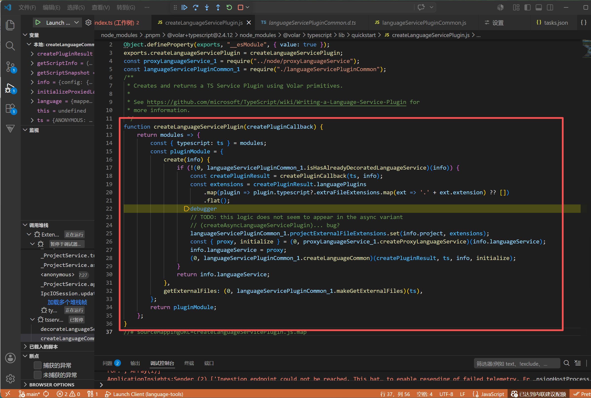
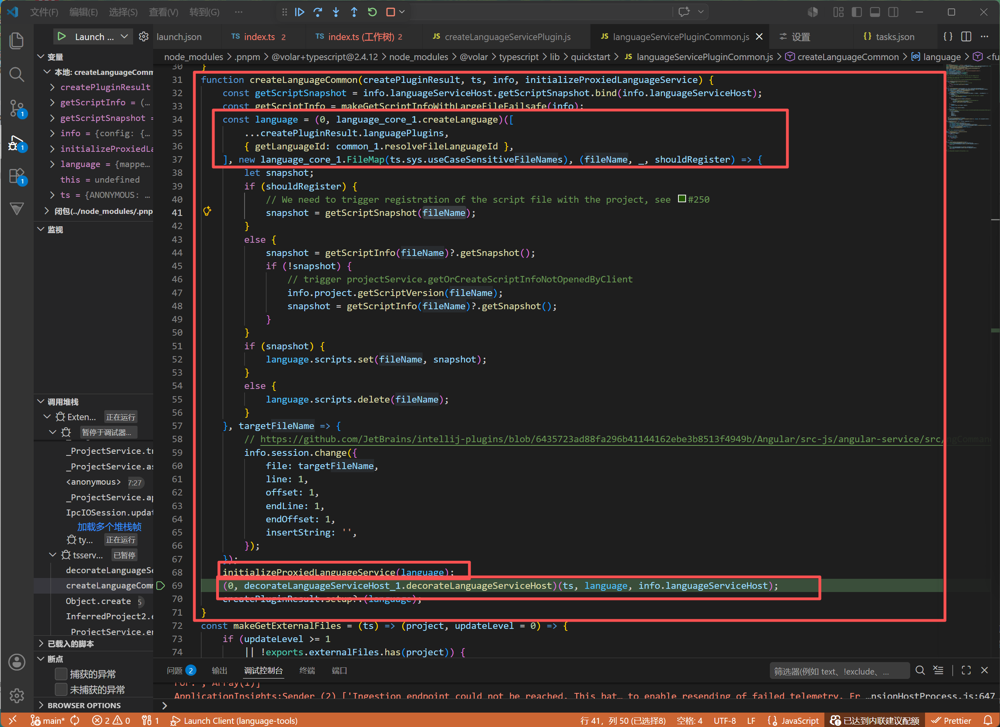
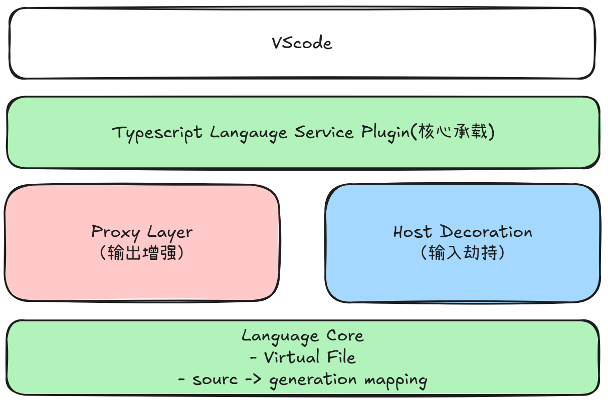

# Mpx-Language-Tools

这是一个基于Volar构建的 Mpx 语言服务插件，核心目标是让.mpx单文件获得和vue类似的IDE能力，包括：类型推导、跳转定义、代码高亮、路径补全等功能

## 整体架构


## 整体核心流程

.mpx -> language-core -> 生成 virtual File -> TypeScript language service -> 获得类型系统能力 -> 映射回.mpx -> LSP输出给 VScode Extension Host

有了这些之后，我们整体就可以运作了，但是从我们是实现的代码来看，他们是隔离的，看着没有连接性，但这一切都是发生在volar内部。那接下来我们深入volar，看看到底发生了什么

## 深入Volar

### volar内部发生的事情


在@mpxjs/typescript-plugin里会使用 createLanguageServicePlugin 方法创建 ts service plugin插件，此时内部就会调用 createLanguageCommon 方法进行初始化。

内部会发生关键的几件事情：
1、createLanguage: 创建Virtual File系统，建立：language.scripts（虚拟文件存储），language.maps（source ↔ generated 映射）
2、初始化 service proxy：应用虚拟文件的ts结果，对外输出增强
3、劫持Ts service Host接口：输入接管，访问 语言文件 时去以 虚拟ts文件 被ts识别。


```javascript
// 整体一个伪代码

// 存储当前文件的虚拟代码
language.script.set(filename, snapshot);

// decorateLanguageServiceHost内部发生的事情
host.getScriptSnapshot = (filename) => {
  if (language.scripts.has(filename)) {
    return "虚拟文件 snapshot";
  }
  return "原始文件";
};

// proxy service，对一些特定的进行增强
new proxy(langaugeService, { get });
```

从源码角度看，Volar 的核心流程是：在 createLanguageCommon 中初始化虚拟文件系统，通过 decorateLanguageServiceHost 劫持 TS 的文件读取能力，使 TS 在分析时读取 Virtual File，而不是将整个虚拟文件注入到TS server里；同时通过 Proxy 包装 LanguageService，在调用 TS 能力前后进行拦截，对返回结果进行语义增强。整个流程实现了“输入用虚拟文件接管，输出用 Proxy 增强”的双层架构。

### 整体分层



### 包结构

volar主要分为四个包：

- language-core: 语言核心处理，解析、生成虚拟代码、更新虚拟代码。
- language-service: 语言服务功能，也就是对应语言特性。
- language-server: 语言服务器，通过语言服务器协议将语言特性给到客户端。
- typescript: 劫持 TS 的输入 + 接管 TS 的输出

### 整个设计理念

这种设计本质上是“对 TypeScript Language Service 的无侵入扩展”，既复用了 TS 的类型系统，又通过分层架构实现了 DSL 语义的可插拔增强。

### 总结

核心一句话： volar = 劫持 TS 输入 + 接管 TS 输出
